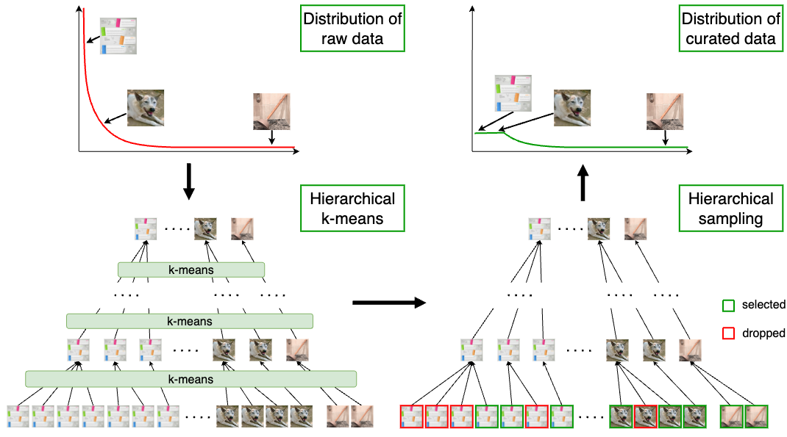
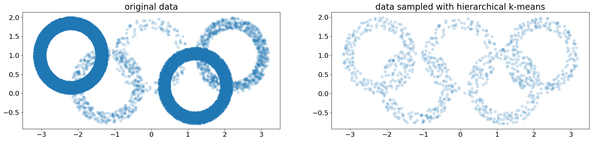

# Automatic Data Curation for Self-Supervised Learning: A Clustering-Based Approach

**[FAIR at Meta](https://ai.facebook.com/research/)**

*Huy V. Vo,
Vasil Khalidov,
Timothée Darcet,
Théo Moutakanni,
Nikita Smetanin,
Marc Szafraniec,
Hugo Touvron,
Camille Couprie,
Maxime Oquab,
Armand Joulin,
Hervé Jégou,
Patrick Labatut,
Piotr Bojanowski*

PyTorch implementation for the data curation pipeline with hierarchical k-means. For more detail, see the paper **[Automatic Data Curation for Self-Supervised Learning: A Clustering-Based Approach](https://arxiv.org/abs/2405.15613)**.

<p align="center">
  
</p> 

## Contents
- [Installation](#installation)
- [Running hierarchical k-means](#running-hierarchical-k-means)
  * [On small data](#on-small-data)
  * [On large data](#on-large-data)
- [Notebook](#notebook)
- [Contributing](#contributing)
- [License](#license)
- [Citation](#citation)

## Installation
```
git clone git@github.com:facebookresearch/ssl-data-curation.git
cd ssl-data-curation
conda create -n ssl-data-curation python=3.10
conda activate ssl-data-curation
pip install -r requirements.txt
```

## Running hierarchical k-means
### On small data
We provide below an example of a 2-level hierarchical k-means on a small toy random dataset. We first run hierarchical k-means on the toy dataset then sample 1000 points from it with hierarchical sampling. A visualisation is provided in [vis/notebook.ipynb](vis/notebook.ipynb).
```
import torch
import numpy as np

from src.clusters import HierarchicalCluster
from src import (
  hierarchical_kmeans_gpu as hkmg,
  hierarchical_sampling as hs
)

def make_ring(n, rmin, rmax):
    r = np.random.rand(n) * (rmax - rmin) + rmin
    alpha = np.random.rand(n) * 2 * np.pi
    return np.vstack([r * np.cos(alpha), r * np.sin(alpha)]).T

data = np.concatenate([
    make_ring(20000, 0.7, 1.0) + np.array([-2.2, 1.]),
    make_ring(200, 0.7, 1.0) + np.array([0., 1.]),
    make_ring(1000, 0.7, 1.0) + np.array([2.2, 1.]),
    make_ring(500, 0.7, 1.0) + np.array([-1.2, 0.2]),
    make_ring(8000, 0.7, 1.0) + np.array([1.2, 0.2]),
])

clusters = hkmg.hierarchical_kmeans_with_resampling(
  data=torch.tensor(data, device="cuda", dtype=torch.float32),
  n_clusters=[1000, 300],
  n_levels=2,
  sample_sizes=[15, 2],
  verbose=False,
)

cl = HierarchicalCluster.from_dict(clusters)
sampled_indices = hs.hierarchical_sampling(cl, target_size=1000)
```

<p align="center">
  
</p> 

### On large data
To launch hierarchical k-means on large data, we need to prepare a config file. We provide below an example illustrating how to launch a 2-level hierarchical k-means on random embeddings with config in [configs/2levels_random_embeddings.yaml](configs/2levels_random_embeddings.yaml).
```
# Prepare the experiment
cd ssl-data-curation
mkdir -p data
cd scripts
python -c 'import numpy as np; np.save( "../data/100k_random.npy", np.random.randn(100000,256))'
python hierarchical_kmeans_launcher.py \
  --exp_dir ../data/2levels_random_embeddings \
  --embeddings_path ../data/100k_random.npy \
  --config_file ../configs/2levels_random_embeddings.yaml

cd ../data/2levels_random_embeddings
# Launch with slurm
bash launcher.sh
# Launch locally if only 1 node is used
# bash local_launcher.sh

cd ssl-data-curation/scripts
# Sampled indices will be saved in ssl-data-curation/data/2levels_random_embeddings/curated_datasets
PYTHONPATH=.. python run_hierarchical_sampling.py \
  --clustering_path ../data/2levels_random_embeddings \
  --target_size 20000 \
  --save
```

We also  provide the config used for our web-based image data pool in [configs/4levels_web_based_images.yaml](configs/4levels_web_based_images.yaml). 

## Notebook
We provide a [notebook](vis/notebook.ipynb) to reproduce visualizations in the paper and show additional examples. 

## Contributing
See [contributing](CONTRIBUTING.md) and the [code of conduct](CODE_OF_CONDUCT.md).

## License
This code is CC-BY-NC 4.0 licensed, as found in [LICENSE](LICENSE).

## Citation
If you find our work useful, please consider giving a star and a citation:
```
@article{vo2024automatic,
  title={Automatic Data Curation for Self-Supervised Learning: A Clustering-Based Approach},
  author={Vo, Huy V. and Khalidov, Vasil and Darcet, Timoth{\'e}e and Moutakanni, Th{\'e}o and Smetanin, Nikita and Szafraniec, Marc and Touvron, Hugo and Couprie, Camille and Oquab, Maxime and Joulin, Armand and Jégou, Hervé and Labatut, Patrick and Bojanowski, Piotr},
  journal={arXiv:2405.15613},
  year={2024},
}
```